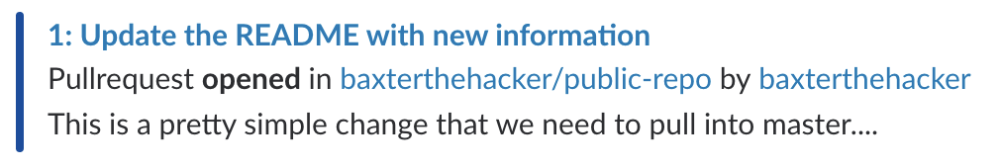
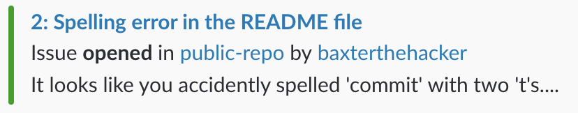

_**Github Slack Notifier —** stay up to date with github notifications in slack_

## Why
The main reason for this bot is to have a more personal approach. I do not want to spam a channel with github notifications, instead the bot sends you direct messages. It will also be more configurable per person in the future.

## Usage

* Create a slack bot [here](https://slack.com/apps/manage/custom-integrations) and get the **API Token**
* Create a whitelist like this: `"githubUsername1:slackUsername1;githubUsername2:slackUsername2"`
* deploy the bot
```
now -e slacktoken=<slack-token> -e whitelist=<githubUsername:slackUsername> littleStudent/github-slack-notifier
```
* Open the settings page of a repository or organisation and add a new **webhook**
* Set the payload URL to your **now deployment url**
* Select content type **application/json**
* Select **send me everything**

---



